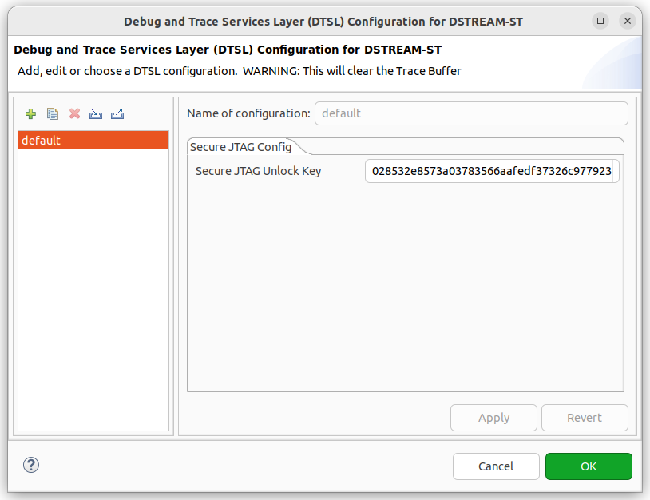

# Configuration database for Microchip UNG Boards

## Introduction

This directory contains a _Configuration Database_ as used by the "Arm
Developer Studio" tool
(<https://developer.arm.com/Tools%20and%20Software/Arm%20Development%20Studio>).

The database supports the following Microchip platforms with the listed features:

| **Platform name** | **Features supported** |
|---|---|
| LAN966X | Secure JTAG, Trace capture, Cache debug |
| LAN969X | Secure JTAG, Cache debug |
| SparX-5 | Cache debug |

## Using the Microchip configuration database

The configuration database has been tested with Arm Developer Studio
2024.1 and 2023.0.

It is very simple to add the Microchip configuration database to Arm
Developer Studio. Open `Window | Preferences`, select
`Arm DS | Configuration Database`, and click `Add` to add a new entry.
Set the location to the directory containing this repository and click
`OK`. Restart Arm Developer Studio when prompted to activate the database.

See the full Arm guide for details:
<https://developer.arm.com/documentation/101470/2024-1/Platform-Configuration/Configuration-database/Add-a-configuration-database>

## Features

### Secure JTAG

The platform configurations support Secure JTAG unlock for products
that have this feature. The `DTSL Options` for a Debug Connection
using these platforms will have a tab panel with a `Secure JTAG Unlock
Key` input field.

The DTSL options for this feature are illustrated below.

The JTAG key should be entered as exactly 64 hexadecimal characters
(representing a 32-byte key) with no prefix or separators, for example:
`0102030405060708090a0b0c0d0e0f101112131415161718191a1b1c1d1e1f20`.
Both uppercase and lowercase hex digits are accepted.

If the Secure JTAG is activated on the target device, the DTSL script
will perform some initial low-level JTAG transfers which will
automatically unlock access to the target CPU system.

If Secure JTAG is not activated, the unlock procedure is skipped and
you will connect directly to the target CPU system.

### Trace Capture

This is a feature implemented by the core Arm Developer Studio,
supported on LAN966X.

The feature allows you to capture low-level performance trace data.

See
<https://developer.arm.com/documentation/101470/2024-1/DTSL/DTSL-Trace?lang=en>
for more information.

### Cache Debug

This is a feature implemented by the core Arm Developer Studio,
supported on LAN966X, LAN969X and SparX-5.

The feature allows you to view contents of caches in your system.

See
<https://developer.arm.com/documentation/101470/2024-1/Debugging-Embedded-Systems/About-debugging-caches?lang=en>
for more information.

## License

See [LICENSE.md](LICENSE.md).
